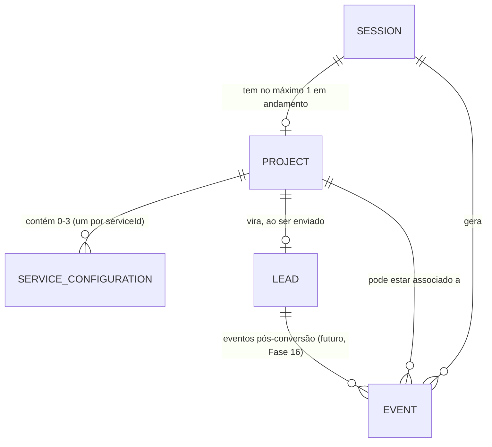

# DATA MODEL CONCEPT — Modelo Conceitual de Dados

> Fase 6 do roadmap. Modelo conceitual das entidades que existirão futuramente (Supabase, Fase 13) —
> sem SQL, sem nomes de tabela/coluna definitivos, sem implementação. O objetivo é ter clareza de
> relações antes de desenhar o schema real.

---

## Entidades

### `Session`

Identidade anônima do visitante, existe antes de qualquer identificação.

| Campo | Tipo | Descrição |
|---|---|---|
| `id` | string | Identificador de sessão (anônimo, gerado no cliente) |
| `source` | enum | `home` \| `menu` \| `secao` \| `campanha` \| `url_direta` |
| `createdAt` | timestamp | Início da sessão |
| `lastSeenAt` | timestamp | Última atividade |
| `projectId` | string (nullable) | Vínculo com o `Project` em andamento, se existir |

### `Project`

O "Meu Upgrade" em si — o agregado de serviços configurados numa sessão. Existe antes de virar lead
(pode ser abandonado sem nunca virar lead).

| Campo | Tipo | Descrição |
|---|---|---|
| `id` | string | Identificador do projeto |
| `sessionId` | string | `Session` de origem |
| `status` | enum | `draft` (em configuração) \| `submitted` (virou lead) |
| `createdAt` / `updatedAt` | timestamp | Controle de criação/atualização |

### `ServiceConfiguration`

Um item dentro de um `Project` — no máximo um por `serviceId` (Site, Tráfego, Design), conforme decisão
da Fase 4/6 (`docs/DECISIONS.md`).

| Campo | Tipo | Descrição |
|---|---|---|
| `id` | string | Identificador da configuração |
| `projectId` | string | `Project` ao qual pertence |
| `serviceId` | enum | `site` \| `trafego` \| `design` |
| `answers` | JSON | Respostas do mini-fluxo (ver `Answer` abaixo — embutido, não normalizado, na V1) |
| `status` | enum | `configuring` \| `complete` |
| `priceSignals` | JSON (nullable) | Sinais marcados (Fase 5) — metadado, não preço |
| `leadScoreSignals` | JSON (nullable) | Sinais marcados (Fase 5) — metadado, não pontuação |
| `createdAt` / `updatedAt` | timestamp | Controle de criação/atualização |

**Decisão de modelagem (V1)**: `answers` fica **embutido como JSON** dentro de `ServiceConfiguration`,
não normalizado numa tabela `Answer` separada — o volume de perguntas por serviço é pequeno (2–6), não
há necessidade de consultar respostas individuais fora do contexto do serviço, e um JSON embutido evita
complexidade de schema prematura. A entidade `Answer` abaixo documenta a forma conceitual de cada
resposta dentro desse JSON, não uma tabela própria.

### `Answer` (conceitual — hoje embutida em `ServiceConfiguration.answers`, não é tabela própria)

| Campo | Tipo | Descrição |
|---|---|---|
| `questionId` | string | ID da pergunta (ex.: `site_tipo`) |
| `value` | string \| string[] | Resposta dada |
| `answeredAt` | timestamp | Quando foi respondida |

Se no futuro houver necessidade real de consultar respostas individuais entre projetos (ex.: analytics
detalhado por pergunta), `Answer` pode ser promovida a tabela própria sem quebrar `ServiceConfiguration`
— o JSON atual já tem a forma que uma linha normalizada teria.

### `Lead`

Criado somente quando os dados de contato são enviados — é o momento em que o projeto deixa de ser
anônimo.

| Campo | Tipo | Descrição |
|---|---|---|
| `id` | string | Identificador do lead |
| `projectId` | string | `Project` de origem |
| `nome` / `empresa` / `whatsapp` / `email` | string | Dados de contato |
| `instagramOuSite` | string (opcional) | Campo complementar |
| `origin` | JSON | Metadado de origem da sessão (`Session.source`) |
| `status` | enum | Status comercial (`novo`, `contatado`, ... — Fase 16, mini-CRM) |
| `createdAt` | timestamp | Momento da conversão |

### `Event`

Log de eventos de navegação/analytics (Fase 17), associado a uma sessão e, quando existir, a um projeto.

| Campo | Tipo | Descrição |
|---|---|---|
| `id` | string | Identificador do evento |
| `sessionId` | string | `Session` de origem |
| `projectId` | string (nullable) | `Project` associado, se já existir |
| `name` | enum | Nome do evento (ver `docs/USER-FLOW.md` — `builder_started`, `service_started`, etc.) |
| `payload` | JSON (nullable) | Dados adicionais do evento |
| `occurredAt` | timestamp | Quando ocorreu |

## Relações

Leitura: uma `Session` pode gerar vários `Event`s ao longo do tempo, e no máximo um `Project` ativo por
vez. Um `Project` tem entre 0 e 3 `ServiceConfiguration` (uma por `serviceId`). Um `Project` só produz um
`Lead` no momento do envio — antes disso, `Lead` simplesmente não existe. `Event`s continuam sendo
gerados mesmo depois da conversão (fora de escopo desta fase modelar isso em detalhe).

## O que fica fora de escopo nesta fase

- Nomes de tabela, tipos de coluna, índices, chaves estrangeiras reais (SQL) — pertence à Fase 13.
- Regras de RLS (Row Level Security) — pertence à Fase 13/30 (Segurança).
- Modelo de `CommercialStatus`/histórico do mini-CRM — mencionado no `PROJECT-OVERVIEW.md`, detalhado
  na Fase 16.
- Cálculo real de `priceSignals`/`leadScoreSignals` em pontuação ou preço — Fases 13/15, apenas o
  metadado é modelado aqui.
