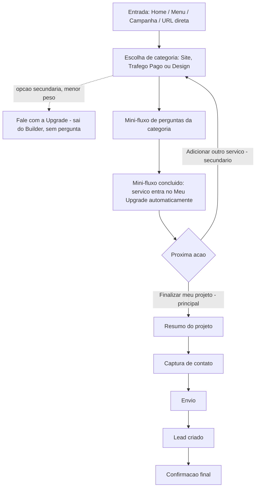
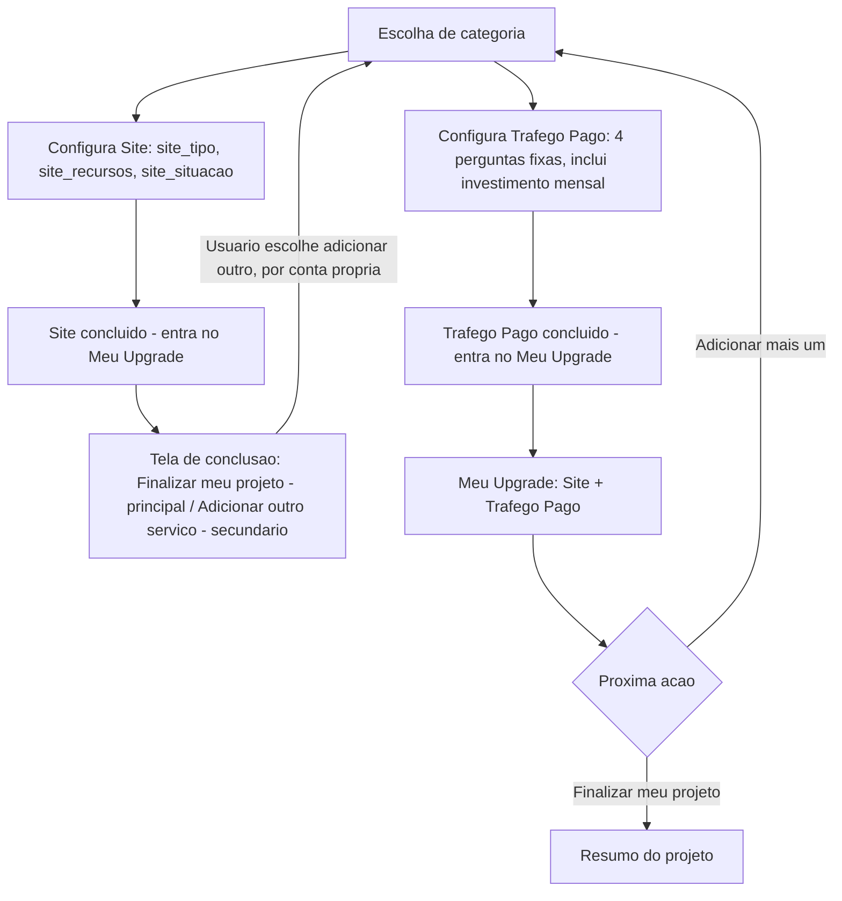
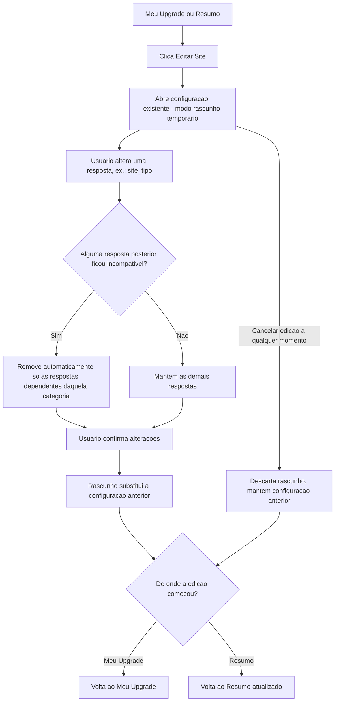
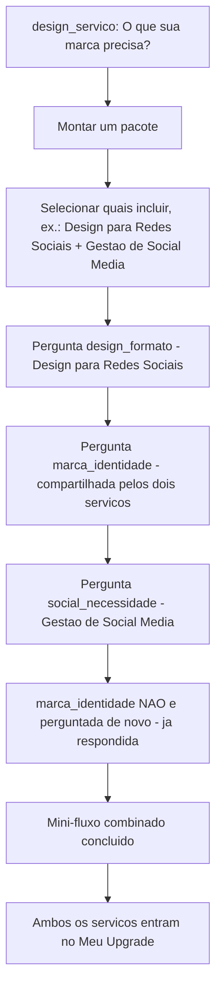
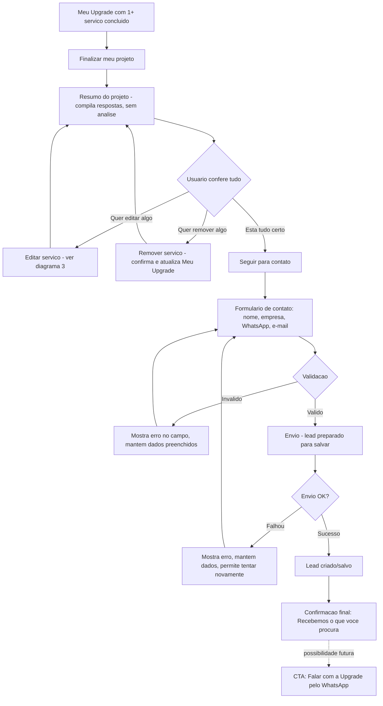

# USER FLOW DIAGRAM — Diagramas do Fluxo do Site da Agência Upgrade

> Fase 4 do roadmap (revisão), corrigida na Fase 5. Diagramas complementares a `docs/USER-FLOW.md`,
> alinhados às 3 categorias e às perguntas realmente implementadas em `lib/builder/config/`. Cada
> diagrama cobre um recorte específico — nenhum tenta mostrar o sistema inteiro de uma vez.
>
> **Correção da Fase 5**: o diagrama 6 ("Me ajude a descobrir", com pergunta e recomendação automática
> de categoria) foi removido — essa função de diagnóstico avançado saiu do escopo do Builder. Os
> diagramas 1 e 2 também tiveram os ramos de recomendação automática entre serviços removidos.
>
> **Alinhamento pré-Etapa 8**: a imagem "Upgrade Builder — Árvore de Escolhas" passa a ser referência
> visual oficial da mesma lógica descrita nestes diagramas, ao lado de `docs/USER-FLOW.md` e do código em
> `lib/builder/config/*.ts`. Os diagramas 2 e 4 foram atualizados para refletir a pergunta
> `trafego_investimento` (Tráfego Pago, agora 4 perguntas) e o rótulo "Montar um pacote" (antes "Quero
> combinar serviços") — ver `docs/DECISIONS.md`. Em caso de conflito futuro entre a imagem e este
> documento/código, o texto/código aprovado prevalece.

---

## 1. Fluxo principal (um serviço, do início ao fim)

"Fale com a Upgrade" é uma saída direta para contato humano — não abre pergunta, não recomenda
categoria, não faz parte do motor de perguntas do Builder.

## 2. Fluxo de múltiplos serviços (adicionados manualmente)

Nenhuma recomendação aparece entre os passos — o segundo serviço só é configurado porque o usuário
decidiu isso por conta própria em "Adicionar outro serviço".

## 3. Fluxo de edição

## 4. Fluxo de Design + Social Media com serviços combinados

Esta combinação é sempre uma escolha manual do usuário na Pergunta 1 de Design — o sistema não sugere
combinar serviços, apenas evita perguntar a mesma coisa duas vezes quando o próprio usuário combina.

## 5. Fluxo de finalização

O lead é considerado criado/salvo **antes** de qualquer redirecionamento ao WhatsApp — o CTA de WhatsApp
é uma continuidade comercial opcional, não implementada nesta fase.
