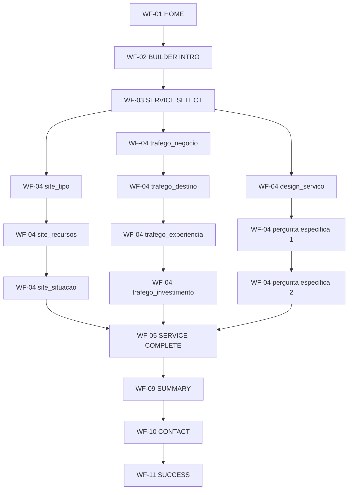

# WIREFRAME FLOW — Sequência de Telas do Wireframe Funcional

> Fase 7 do roadmap. Mostra a sequência de telas (IDs de `docs/WIREFRAME-SCREENS.md`) para o fluxo
> principal e suas variações. Não redefine navegação/regras — apenas projeta o que já está decidido em
> `docs/USER-FLOW.md` e `docs/USER-FLOW-DIAGRAM.md` sobre as telas concretas deste wireframe.

---

## 1. Fluxo principal (um serviço, do início ao fim)

A sequência de perguntas (WF-04) é **fixa por categoria**, nunca variável em tempo de execução — e o
número de perguntas difere entre categorias (2-3 para Site, 4 para Tráfego Pago, 3 para Design) porque
cada uma é o mínimo aprovado individualmente para aquele serviço, não uma quantidade padrão exigida
igualmente das três (ver princípio e contagem exata em `docs/WIREFRAME.md`, Seção 6). As três sequências
reais:

```
Site (3 perguntas fixas; 2 se site_tipo = "Ainda não sei"):
WF-01 → WF-02 → WF-03
  → WF-04 (site_tipo)
  → WF-04 (site_recursos — pulada se site_tipo = "Ainda não sei")
  → WF-04 (site_situacao)
  → WF-05 → WF-09 → WF-10 → WF-11

Tráfego Pago (4 perguntas fixas, sempre):
WF-01 → WF-02 → WF-03
  → WF-04 (trafego_negocio)
  → WF-04 (trafego_destino)
  → WF-04 (trafego_experiencia)
  → WF-04 (trafego_investimento — investimento mensal em mídia paga, não orçamento do projeto)
  → WF-05 → WF-09 → WF-10 → WF-11

Design/Social Media — um serviço (3 perguntas fixas, para qualquer um dos 5 serviços):
WF-01 → WF-02 → WF-03
  → WF-04 (design_servico)
  → WF-04 (pergunta específica 1 do serviço escolhido)
  → WF-04 (pergunta específica 2 do serviço escolhido)
  → WF-05 → WF-09 → WF-10 → WF-11
```

Nenhuma dessas sequências é decidida pelo sistema em tempo de navegação — são as árvores já aprovadas na
Etapa 3 (e, para `trafego_investimento`, no alinhamento pré-Etapa 8), em
`lib/builder/config/site.ts`, `trafego.ts`, `design.ts`, apenas percorridas.



---

## 2. Variação — entrada direta (sem Home)

```
(menu institucional / seção da Home / campanha de tráfego / URL direta)
  → WF-02 BUILDER INTRO
  → WF-03 SERVICE SELECT
  → ... (resto igual ao fluxo principal)
```

A Home (WF-01) é uma via de entrada opcional, nunca obrigatória — consistente com `USER-FLOW.md`,
Seção 2.

---

## 3. Variação — múltiplos serviços

```
WF-03 SERVICE SELECT
  → WF-04 QUESTION (Site)
  → WF-05 SERVICE COMPLETE
  → [CTA secundário: Adicionar outro serviço]
  → WF-03 SERVICE SELECT  (Site já marcado "Configurado")
  → WF-04 QUESTION (Tráfego Pago)
  → WF-05 SERVICE COMPLETE
  → [CTA principal: Finalizar meu projeto]
  → WF-09 SUMMARY  (mostra Site + Tráfego Pago)
  → WF-10 CONTACT
  → WF-11 SUCCESS
```

Também alcançável passando por **WF-06 MY UPGRADE** entre um serviço e outro (o usuário abre o painel
para conferir antes de decidir adicionar mais um):

```
WF-05 SERVICE COMPLETE → WF-06 MY UPGRADE → [+ Adicionar serviço] → WF-03 SERVICE SELECT → ...
```

---

## 4. Variação — edição

```
WF-06 MY UPGRADE (ou WF-09 SUMMARY)
  → [Editar Site]
  → WF-07 EDIT SERVICE
  → [Confirmar alterações]  → volta para WF-06 (ou WF-09), atualizado
       ou
  → [Cancelar edição]       → volta para WF-06 (ou WF-09), inalterado
```

Editar a partir do seletor (categoria já configurada) segue a mesma tela WF-07:

```
WF-03 SERVICE SELECT → [clica em categoria "Configurada"] → WF-07 EDIT SERVICE → ...
```

---

## 5. Variação — remoção

```
WF-06 MY UPGRADE (ou WF-09 SUMMARY)
  → [Remover Tráfego Pago]
  → WF-08 REMOVE CONFIRM
  → [Remover]  → volta para WF-06/WF-09, atualizado (ou WF-13 EMPTY, se esvaziar o projeto)
       ou
  → [Cancelar] → volta para WF-06/WF-09, inalterado
```

---

## 6. Variação — indeciso ("Fale com a Upgrade")

```
WF-03 SERVICE SELECT
  → [Fale com a Upgrade — CTA secundário, menor peso]
  → (sai do Builder — canal de contato humano direto, fora deste wireframe)
```

Não abre nenhuma tela WF-04 nem gera recomendação — é uma saída direta do Builder, conforme
`docs/USER-FLOW.md`, Seção 12.

---

## 7. Variação — "Ainda não sei" dentro do Site

```
WF-03 SERVICE SELECT
  → WF-04 QUESTION (site_tipo = "Ainda não sei")
  → WF-04 QUESTION (site_situacao — pula site_recursos)
  → WF-05 SERVICE COMPLETE
```

Diferença do fluxo principal: uma pergunta a menos (`site_recursos` não é exibida) — sem tela nova, sem
recomendação.

---

## 8. Variação — invalidação em cascata durante edição

```
WF-07 EDIT SERVICE (Site, alterando site_tipo de "Loja Virtual" para "Landing Page")
  → resposta anterior de site_recursos (específica de e-commerce) é descartada automaticamente
  → WF-04 QUESTION reaparece dentro da própria edição, agora com as opções corretas de Landing Page
  → [Confirmar alterações] → volta para a origem, atualizado
```

Nenhuma tela nova — a mesma WF-04 é reutilizada dentro do fluxo de edição (WF-07), com o conjunto de
opções recalculado.

---

## 9. Variação — erro no envio do lead

```
WF-09 SUMMARY
  → WF-10 CONTACT
  → [Enviar meu projeto] → falha
  → WF-12 ERROR (mensagem de falha, dados preenchidos mantidos)
  → [Tentar novamente]
  → WF-10 CONTACT (mesmos dados, sem precisar redigitar)
  → [Enviar meu projeto] → sucesso
  → WF-11 SUCCESS
```

---

## 10. Variação — projeto esvaziado por completo

```
WF-06 MY UPGRADE (1 serviço restante)
  → [Remover]
  → WF-08 REMOVE CONFIRM
  → [Remover]
  → WF-13 EMPTY ("Nenhum serviço adicionado ainda.")
  → [Escolher um serviço]
  → WF-03 SERVICE SELECT
```

"Finalizar meu projeto" fica indisponível durante o estado WF-13 — nenhuma navegação leva a WF-09 nesse
estado.

---

## Confirmação de cobertura

Todas as 13 telas de `docs/WIREFRAME-SCREENS.md` aparecem em pelo menos uma sequência acima; nenhuma
sequência termina fora de uma tela conhecida (sem becos sem saída), e toda variação retorna a um estado
já mapeado do fluxo principal.
